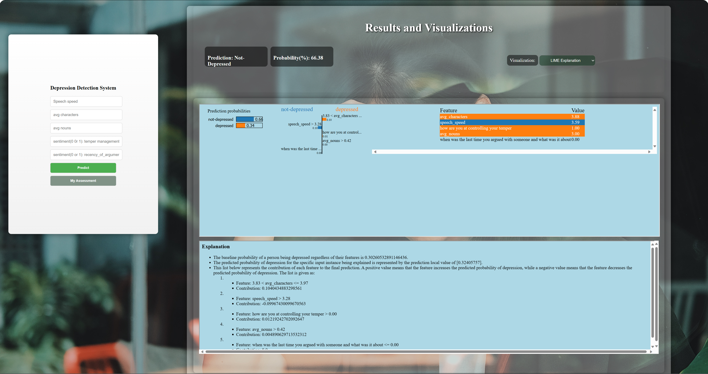
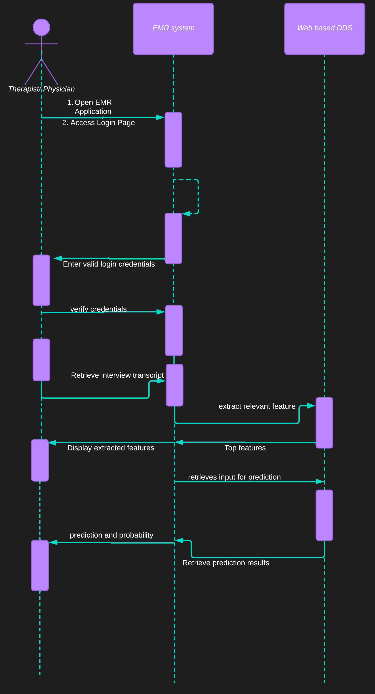
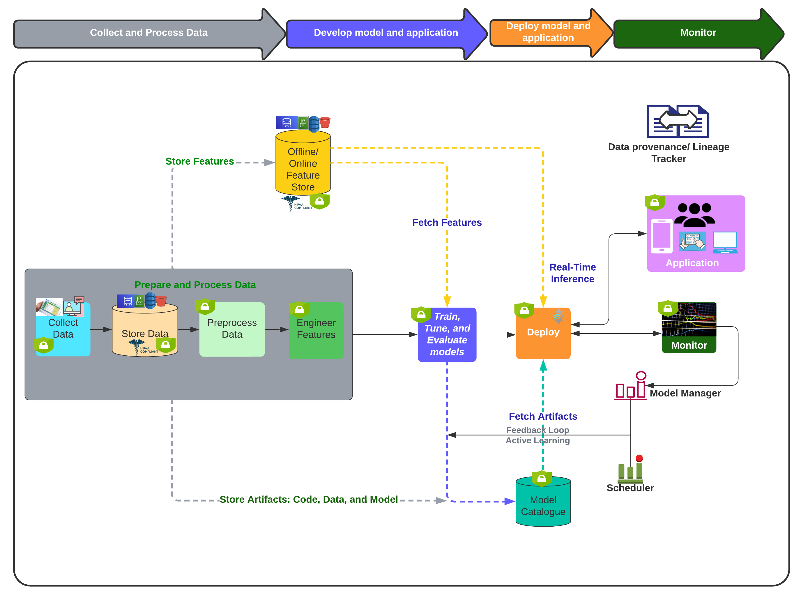

# earlyDETECT

Depression Detection System as part of a decision support tool. 

In this project we demonstrate a possible workflow for prescreening for depression based on a trained ML model and five features. These features include:
<ul>
  <li>**average number of characters in response**</li>
  <li>**average number of nouns used in the response**</li>
  <li>**Speech speed**</li>
  <li>Sentiment of their response to **how are you at controlling your temper?**</li>
  <li>Sentiment of their response to **when was the last time you argued with someone and what was it about?**</li>
</ul>

We also provide possible explanation for the model's decision in terms of feature impact or contribution on every outcome. For each interpretation, we leverage LIME (Local Interpretable Model-Agnostic Explanations). After each inference, users can click on the visualization dropdown in the top right to view the LIME plots, Feature importance, and one of the decision trees.

To watch the demo, click on the first image with the youtube icon.

Here is the user flow or interaction:

The architecture diagram is:

